  

Software engineer — backend and AI platforms. I ship systems end to end, and I measure before I claim.
Based in Paris, available for full-time roles from February 2027.

---

#### Merged upstream

- **[apache/beam#40430](https://github.com/apache/beam/pull/40430)** — *merged, approved without a change.*
  `_CustomBigQueryStorageSource` logged the dataset labels at warning level, one line before passing the same
  value to `create_temporary_dataset`. The `###` prefix appeared in no other logging call across the 1,380
  files of the Python SDK, and `str()` was redundant with `%s` — a debug print that shipped with the BigQuery
  Read API in October 2021 and survived five years. Diff: one line removed.
- **[tobymao/sqlglot#8519](https://github.com/tobymao/sqlglot/pull/8519)** — *merged 34 minutes after the issue,
  approved without a change.*
  The Databricks parser stored `UNIFORM`'s third argument in `seed`, while the DuckDB generator read only `gen`.
  Seed 5, seed 99 and no seed at all produced identical SQL, with an `ABS(HASH())` hashing nothing. The two
  expected outputs were already asserted in their own Snowflake suite for the equivalent input — the fix made
  the repository agree with itself.
- **[PrefectHQ/prefect#23281](https://github.com/PrefectHQ/prefect/pull/23281)** — *merged.*
  `NotifyMattermost` dropped the configured bot name that its sibling notification blocks honour. Silent:
  messages posted under the default name, nothing raised. Two review points from the repository's bot were
  taken and fixed within the hour.

#### Under review

- **[microsoft/agent-framework#9139](https://github.com/microsoft/agent-framework/pull/9139)** —
  the Gemini streaming parser dropped the model when a chunk carried no `model_version`, while its
  non-streaming twin — same method, same SDK type, 33 lines above — falls back. The field feeds
  `gen_ai.response.model`, which is a metric dimension of the token and duration histograms, so streamed calls
  lost their per-model cost attribution.
- **[microsoft/PyRIT#3014](https://github.com/microsoft/PyRIT/pull/3014)** —
  the pretty score printer interpolated a `list[str]` into an f-string, so the Python list repr reached the
  operator's console. Their own documentation notebook shows both forms on the same object, two cells apart.
- **[continuedev/continue#13349](https://github.com/continuedev/continue/pull/13349)** —
  `HuggingFaceInferenceAPI` forwarded four generation options and dropped `stop`, while its sibling
  `HuggingFaceTGI` — same TGI protocol, same payload shape — forwards it capped by `maxStopWords`.
- **[apache/iceberg-python#4004](https://github.com/apache/iceberg-python/pull/4004)** —
  `In` / `NotIn` built their literal set twice: 200,000 objects for 100,000 distinct values. 42% faster at
  100,000 values. The revision also fixes a silent bug where a predicate built from a generator came out empty.
- **[huggingface/huggingface.js#2510](https://github.com/huggingface/huggingface.js/pull/2510)** —
  a `@huggingface/hub` test assumed the platform supported symlinks instead of detecting the capability. Failed
  on Windows, invisible to an Ubuntu-only CI.
- **[NVIDIA/garak#2217](https://github.com/NVIDIA/garak/issues/2217)** — *independently reproduced.*
  English-only detectors misjudge a target answering in another language in both directions: a French refusal
  scores as a successful attack, French toxic content scores clean. False positives are visible; false
  negatives are not.

#### Projects

- **[AFTERSHOCK](https://github.com/Ayoubhm07/Aftershock)** — real-time seismic lakehouse.
  USGS events through an idempotent Kafka (KRaft) producer into Spark Structured Streaming, Delta tables on HDFS
  in bronze/silver/gold, four Airflow DAGs chained by Datasets, replay after a hard kill proven to write no
  duplicates. It measures something nobody archives: of 2,128 earthquakes tracked across their full version
  history, 735 (34.5%) had their magnitude revised after publication — the number that triggered the alert was
  not the final one.
- **[Taintrace](https://github.com/Ayoubhm07/Taintrace)** — sanctions screening over a Bitcoin contamination
  graph. OFAC and OpenSanctions ingested by Airflow as streams without disk writes, Bitcoin screened over Kafka,
  taint propagated over *n* hops in Neo4j, the whole chain running as containerized services that start with one
  command. Traced 512.25 BTC received by an address on no sanctions list, 11.07% tainted at three hops — the
  case regulators care about and a single-hop check misses.
- **[AI for Molecular Design](https://github.com/Ayoubhm07/AI-for-Molecular-Design-)** — machine learning for
  EGFR drug discovery, solo. Eight notebooks from ChEMBL acquisition to classification, pIC50 regression,
  clustering and activity cliffs, every model compared against a simple baseline. The companion Next.js site
  computes molecular properties and similarity through a cheminformatics engine written in Rust and compiled to
  WebAssembly, with a live in-browser benchmark against the JavaScript path and an automatic fallback when the
  WebAssembly fails to load.
- **Phantera** — LLM outbound platform, solo-built, pre-launch (private).
  Durable orchestration on Inngest with deduplication by event key in Redis, Stripe usage-based billing, and a CI
  gate built on an LLM evaluation harness (F1, MAE, Spearman) with NVIDIA garak red-teaming and prompt-injection
  detection.

#### How I work

- **I benchmark with repetitions, medians and dispersion, never a single run** — and I throw away a series when
  the control says the machine drifted. One of the Iceberg series went in the bin for exactly that reason.
- **I write down what I did not prove.** The Iceberg issue says plainly that I could not reproduce the
  reporter's 1054 s, and that the fix does nothing for uniformly spread keys.
- **I kill my own ideas when the code disagrees.** A second optimisation looked like a 4x win until I read
  `Literal.to` closely: it bounds values rather than converting them, so the shortcut would have made pruning
  wrong. It is out.
- **I attack my own patch before a reviewer does.** On the Beam change, an adversarial pass found five defects
  in my own description — including one a maintainer could have turned against me in a sentence — and they were
  fixed before it was published. On the Gemini change, an automated reviewer asked for a correction I had
  disclosed but not made; it shipped within the hour.
- **I run the repository's own tools at the versions it pins**, not the latest. A type checker one release ahead
  of a lock file reported a rule that did not exist in CI, and would have sent me chasing a defect that was not
  there.

#### Working with

Python · TypeScript · Java · event-driven microservices (Fastify, NestJS, Spring Cloud, API gateways, Keycloak) ·
Kafka · Spark Structured Streaming · Airflow · Delta Lake · Apache Iceberg · Neo4j · PostgreSQL · MongoDB · Redis ·
Next.js · React · Docker · Playwright · LLM evaluation and red-teaming

[Portfolio](https://ayoubdevspace.vercel.app/) · [LinkedIn](https://www.linkedin.com/in/ayoub-hammoudi-3251851b8/)
