**Merged** &nbsp;[apache/beam#40430](https://github.com/apache/beam/pull/40430) &middot; [tobymao/sqlglot#8519](https://github.com/tobymao/sqlglot/pull/8519) &middot; [PrefectHQ/prefect#23281](https://github.com/PrefectHQ/prefect/pull/23281)

**Under review** &nbsp;[microsoft/agent-framework#9139](https://github.com/microsoft/agent-framework/pull/9139) &middot; [microsoft/PyRIT#3014](https://github.com/microsoft/PyRIT/pull/3014) &middot; [continuedev/continue#13349](https://github.com/continuedev/continue/pull/13349) &middot; [apache/iceberg-python#4004](https://github.com/apache/iceberg-python/pull/4004) &middot; [huggingface.js#2510](https://github.com/huggingface/huggingface.js/pull/2510) &middot; [NVIDIA/garak#2217](https://github.com/NVIDIA/garak/issues/2217)

**Projects** &nbsp;[AFTERSHOCK](https://github.com/Ayoubhm07/Aftershock) &middot; [Taintrace](https://github.com/Ayoubhm07/Taintrace) &middot; [AI for Molecular Design](https://github.com/Ayoubhm07/AI-for-Molecular-Design-) &middot; [Portfolio](https://ayoubdevspace.vercel.app/) &middot; [LinkedIn](https://www.linkedin.com/in/ayoub-hammoudi-3251851b8/)
